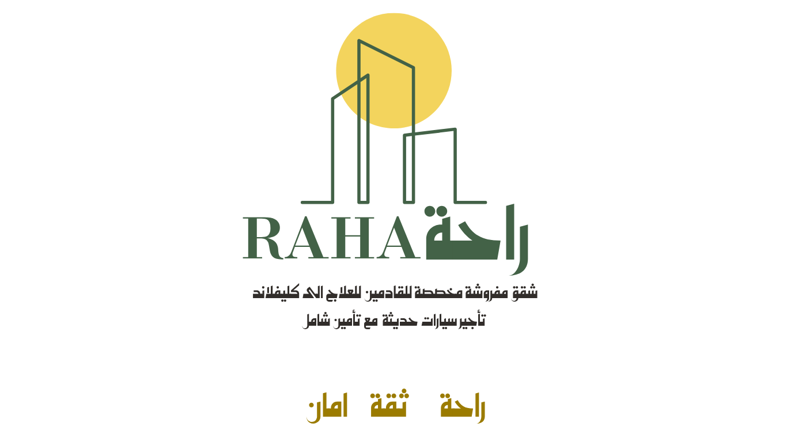

# Raha  | راحة 

<div align="center">
  
  
  <h3>Premium Real Estate & Car Rental Mobile App</h3>
  <p>تطبيق محمول فاخر للعقارات وتأجير السيارات</p>
  
  
  
  
  
</div>

---

## 📱 Overview | نظرة عامة

**Raha Luxury** is a premium mobile application that provides luxury real estate booking and car rental services in Saudi Arabia. The app offers a seamless bilingual experience (Arabic/English) for customers to browse, book, and manage luxury accommodations and vehicle rentals.

**راحة ** هو تطبيق محمول فاخر يوفر خدمات حجز العقارات الفاخرة وتأجير السيارات في المملكة العربية السعودية. يقدم التطبيق تجربة سلسة ثنائية اللغة (عربي/إنجليزي) للعملاء لتصفح وحجز وإدارة الإقامة الفاخرة واستئجار المركبات.

## ✨ Features | المميزات

### 🏠 Real Estate | العقارات

- **4 Luxury Buildings** | **4 مباني فاخرة**

  - Aster Residence | سكن الأستر
  - Vantage Residence | سكن الفانتج
  - Hospital Apartments | شقق المستشفى
  - Lumos Apartments | شقق لوموس

- **Online Booking System** | **نظام الحجز الأونلاين**
  - Instant booking confirmation | تأكيد حجز فوري
  - Real-time availability | توفر في الوقت الفعلي
  - WhatsApp integration | تكامل مع واتساب
  - Detailed apartment information | معلومات تفصيلية عن الشقق

### 🚗 Car Rental | تأجير السيارات

- Premium vehicle fleet | أسطول مركبات فاخر
- Flexible rental options | خيارات استئجار مرنة
- Direct booking system | نظام حجز مباشر

### 🔧 Maintenance Services | خدمات الصيانة

- Request maintenance online | طلب صيانة أونلاين
- Track service status | تتبع حالة الخدمة
- Priority-based handling | معالجة حسب الأولوية

### 🌐 Bilingual Support | دعم ثنائي اللغة

- Arabic and English | العربية والإنجليزية
- RTL/LTR text support | دعم النصوص من اليمين لليسار واليسار لليمين
- Localized content | محتوى محلي

## 🛠 Technology Stack | التقنيات المستخدمة

### Frontend | الواجهة الأمامية

- **React Native** 0.79.4
- **Expo** 53.0.12 (JSC Engine)
- **React Navigation** 6.x
- **Expo Vector Icons**

### Backend | الخلفية

- **Supabase** (Database & Authentication)
- **PostgreSQL** (Database)
- **Real-time subscriptions**

### Styling | التصميم

- **React Native StyleSheet**
- **Custom animations**
- **Responsive design**

### Communication | التواصل

- **WhatsApp API Integration**
- **Deep linking**
- **Push notifications** (planned)

## 📦 Installation | التثبيت

### Prerequisites | المتطلبات

- Node.js >= 18.0.0
- npm >= 8.0.0
- Expo CLI
- Expo Go app (for testing)

### Setup | الإعداد

1. **Clone the repository** | **استنساخ المشروع**

```bash
git clone https://github.com/raha-luxury/mobile-app.git
cd raha-luxury
```

2. **Install dependencies** | **تثبيت الحزم**

```bash
npm install
```

3. **Configure environment** | **تكوين البيئة**

```bash
# Copy environment template
cp .env.example .env

# Edit .env with your Supabase credentials
# قم بتحرير .env مع بيانات Supabase الخاصة بك
```

4. **Start the development server** | **تشغيل خادم التطوير**

```bash
npm run dev
# or
npm start
```

5. **Open in Expo Go** | **افتح في Expo Go**

- Scan the QR code with Expo Go app
- امسح رمز QR بتطبيق Expo Go

## 🗄 Database Schema | مخطط قاعدة البيانات

### Tables | الجداول

```sql
-- Buildings table | جدول المباني
buildings (
  id, name, name_en, description, description_en,
  total_apartments, available_apartments, image_url,
  created_at, updated_at, is_active
)

-- Apartments table | جدول الشقق
apartments (
  id, building_id, apartment_number, type, description,
  floor, view, price, features, images, available,
  created_at, updated_at
)

-- Bookings table | جدول الحجوزات
bookings (
  id, apartment_id, building_id, guest_name, guest_email,
  guest_phone, check_in, check_out, number_of_guests,
  status, booking_source, notes, total_amount,
  created_at, updated_at
)

-- Maintenance requests | طلبات الصيانة
maintenance_requests (
  id, building_id, apartment_id, request_type, description,
  priority, status, notes, created_at, updated_at
)

-- Inquiries | الاستفسارات
inquiries (
  id, name, email, phone, inquiry_type, message,
  status, reply, created_at, updated_at
)
```

## 📱 Available Scripts | الأوامر المتاحة

```bash
# Development | التطوير
npm start                 # Start Expo dev server
npm run dev              # Start with cache clear
npm run android          # Run on Android emulator
npm run ios              # Run on iOS simulator
npm run web              # Run on web browser

# Building | البناء
npm run build:android    # Build Android APK
npm run build:ios        # Build iOS IPA

# Maintenance | الصيانة
npm run clean            # Clear cache
npm run reset            # Reset and reinstall dependencies
npm run doctor           # Check project health
npm run upgrade          # Upgrade Expo SDK

# Quality | الجودة
npm run lint             # Run ESLint
npm run format           # Format with Prettier
npm test                 # Run tests
```

## 🏗 Project Structure | هيكل المشروع

```
raha-luxury/
├── App.js                 # Main app component
├── index.js              # Entry point
├── app.json              # Expo configuration
├── package.json          # Dependencies
├── supabaseConfig.js     # Database configuration
│
├── src/
│   ├── screens/          # App screens
│   │   ├── HomeScreen.js
│   │   ├── AsterDetails.js
│   │   ├── VantageDetails.js
│   │   ├── HospitalDetails.js
│   │   ├── LumosDetails.js
│   │   ├── CarRentalScreen.js
│   │   ├── MaintenanceDetails.js
│   │   └── WelcomeVideoScreen.js
│   │
│   └── services/         # API services
│       └── database.js   # Supabase services
│
└── assets/               # Static assets
    ├── images/
    ├── videos/
    └── icons/
```

## 🔐 Environment Variables | متغيرات البيئة

Create a `.env` file in the root directory:

```env
EXPO_PUBLIC_SUPABASE_URL=https://your-project-id.supabase.co
EXPO_PUBLIC_SUPABASE_ANON_KEY=your-anon-key
EXPO_PUBLIC_WHATSAPP_NUMBER=+966507999129
EXPO_PUBLIC_APP_VERSION=1.0.0
```

## 📞 Contact Integration | تكامل التواصل

### WhatsApp Integration | تكامل واتساب

- Direct booking links | روابط حجز مباشرة
- Automated messages | رسائل آلية
- Customer support | دعم العملاء

Phone: `+966507999129`

## 🚀 Deployment | النشر

### Expo EAS Build

```bash
# Install EAS CLI
npm install -g @expo/eas-cli

# Login to Expo
eas login

# Configure build
eas build:configure

# Build for production
eas build --platform all
```

### App Store Deployment

1. **iOS App Store**

   - Build with EAS
   - Upload to App Store Connect
   - Submit for review

2. **Google Play Store**
   - Build AAB with EAS
   - Upload to Google Play Console
   - Submit for review

## 🐛 Troubleshooting | حل المشاكل

### Common Issues | المشاكل الشائعة

1. **Metro bundler cache issues**

```bash
npm run clean
npm start -- --reset-cache
```

2. **Supabase connection issues**

```bash
# Check environment variables
# تحقق من متغيرات البيئة
echo $EXPO_PUBLIC_SUPABASE_URL
```

3. **Build failures**

```bash
# Clear node modules and reinstall
rm -rf node_modules
npm install
```

## 📋 TODO | المهام المستقبلية

- [ ] Push notifications | إشعارات فورية
- [ ] Dark mode support | دعم الوضع المظلم
- [ ] Advanced search filters | فلاتر بحث متقدمة
- [ ] Payment integration | تكامل الدفع
- [ ] User authentication | مصادقة المستخدم
- [ ] Offline support | دعم عدم الاتصال
- [ ] Performance optimizations | تحسينات الأداء
- [ ] Accessibility improvements | تحسينات إمكانية الوصول

## 📄 License | الترخيص

This project is licensed under the 0BSD License - see the [LICENSE](LICENSE) file for details.

هذا المشروع مرخص تحت ترخيص 0BSD - راجع ملف [LICENSE](LICENSE) للتفاصيل.

## 🤝 Contributing | المساهمة

1. Fork the project | انسخ المشروع
2. Create your feature branch | أنشئ فرع للميزة الجديدة
3. Commit your changes | احفظ التغييرات
4. Push to the branch | ادفع للفرع
5. Open a Pull Request | افتح طلب دمج

## 👥 Team | الفريق

- **Development Team** | فريق التطوير
- **Design Team** | فريق التصميم
- **QA Team** | فريق ضمان الجودة

## 📞 Support | الدعم

For support, email **info@rahaluxury.com** or join our WhatsApp support.

للدعم، راسلنا على **info@rahaluxury.com** أو انضم لدعم واتساب.

---

<div align="center">
  <p>Made with ❤️ by Raha Luxury Team</p>
  <p>صُنع بـ ❤️ من فريق راحة لوكشري</p>
</div>
